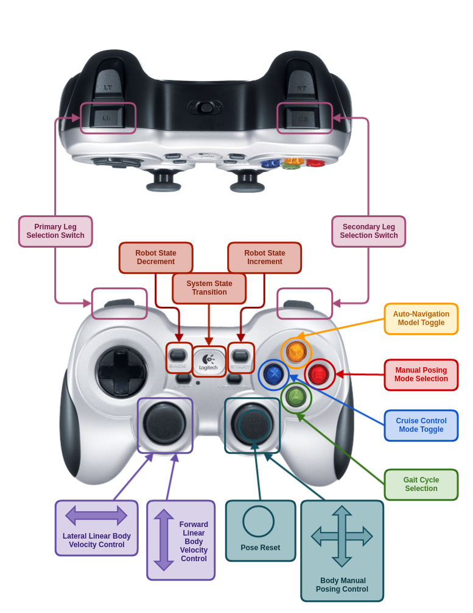

# Syropod Remote

[](https://research.csiro.au/robotics/)

An interface between user input via Joypad/Keyboard/Tablet and the OpenSHC

**Current version:** v0.5.0

## Getting Started

If you haven't looked at the tutorials for using OpenSHC, see [OpenSHC Tutorials](https://github.com/csiro-robotics/shc_tutorials).

### Requirements

* Ubuntu 18.04 LTS
* ROS Melodic

### Dependencies

* [syropod_highlevel_controller](https://github.com/csiro-robotics/syropod_highlevel_controller)
* [ROS Joystick](http://wiki.ros.org/joy)
  * `sudo apt-get install ros-melodic-joy`

### Installation

```bash
mkdir -p openshc_ws/src
cd openshc_ws/src
git clone https://github.com/csiro-robotics/syropod_remote.git
cd ..
catkin build
```

## Input Device Mapping

### Joypad Control

Default control scheme for Logitech F710 wireless gamepad.



#### Buttons

* Logitech:
  * System State Transition
* Start:
  * Robot State Increment
* Back:
  * Robot State Decrement
* A (Green):
  * Gait Cycle Selection
* B (Red):
  * Manual Posing Mode Selection
* X (Blue):
  * Cruise Control Mode Toggle
* Y (Yellow):
  * Auto-Navigation Mode Toggle
* Left Joystick Button
  * UNASSIGNED
  * Primary Leg State Toggle (with primary leg selected)
* Right Joystick Button
  * Pose Reset
  * Secondary Leg State Toggle (with secondary leg selected)
* Left Bumper:
  * Primary Leg Selection
  * Primary Leg Manipulation Mode (with primary leg in manipulation)
* Right Bumper:
  * Secondary Leg Selection
  * Secondary Manipulation Mode (with secondary leg in manipulation)

#### Axes

* Left Joystick:
  * Linear Body Velocity Input
  * Primary Leg Manipulation Input
* Right Joystick:
  * Body Manual Posing Input
  * Secondary Leg Manipulation Input
* Left/Right Triggers:
  * Angular Body Velocity Input
* DPAD:
  * Parameter Selection
  * Parameter Adjustment

### Tablet Control

Please read readme of `syropod_tablet_control` for control using tablet PCs.

### Keyboard Control

Please refer to readme of `syropod_keyboard_control` for control scheme and key mapping.

## Commands

### Buttons

* System State Transition:
  * Controls SHC system state. Press to start/suspend/resume control.
* Robot State Increment:
  * Increments robot state. Press to transition forward through possible robot states. (i.e. PACKED->READY->RUNNING)
* Robot State Decrement:
  * Decrements robot state. Press to transition backward through possible robot states. (i.e. RUNNING->READY->PACKED)
* Gait Cycle Selection:
  * Cycles through possible gait selections defined in config/gait.yaml (defaults include Wave, Amble, Ripple and Tripod)
* Manual Posing Mode Selection:
  * Cycles through manual body posing modes:
    * NO\_POSING: NO posing input.
    * X\_Y\_POSING: Linear translational posing in the x-axis and y-axis of the robot frame.
    * ROLL\_PITCH\_POSING: Angular rotational posing about he x-axis (roll) and y-axis (pitch) of the robot frame.
    * Z\_YAW\_POSING: Right Linear translational posing in the z-axis and angular rotational posing about the z-axis (yaw) of the robot frame.
* Cruise Control Mode Toggle:
  * Starts/Stops cruise control mode. Cruise control sets a constant input velocity dependent on:
    * The input body velocities at activation OR
    * Parameter values defined in `config/\*SYROPOD_NAME\*.yaml`
* Auto-Navigation Mode Toggle:
  * Starts/Stops auto navigation mode. Auto navigation required correct sensing capabilities and `syropod_auto_navigation`.
* Pose Reset Mode:
  * If no leg is selected for primary manipulation - reset all current body poses to zero (according to current POSING_MODE)
* Parameter Selection:
  * Cycles through possible adjustable parameter selections.
* Parameter Adjustment:
  * Adjusts selected parameter by incrementing/decrementing according to adjustment step amount defined in `config/\*SYROPOD_NAME\*.yaml`.
* Primary Leg Selection:
  * Cycles through possible leg selections for primary leg manipulation.
* Secondary Leg Selection:
  * Cycles through possible leg selections for secondary leg manipulation.
* Primary Leg State Toggle:
  * If a leg is selected for primary manipulation - toggles leg manipulation for primary selected leg.
* Secondary Leg State Toggle:
  * If a leg is selected for secondary manipulation - toggles leg manipulation for secondary selected leg.
* Leg Manipulation Mode:
  * Whilst in leg manipulation, cycles between tip velocity input mode or secondary selected leg. (i.e. Manipulation in X/Y or Z/Y planes)
* Leg Manipulation Mode:
  * Whilst in leg manipulation, cycles between tip velocity input mode or secondary selected leg. (i.e. Manipulation in X/Y or Z/Y planes)

### Axes

* Linear Body Velocity Input:
  * Commands desired linear body velocity.
    * Positive/negative velocity input in the x-axis of the robot frame. (i.e. robot forward/backward)
    * Positive/negative velocity input in the y-axis of the robot frame. (i.e. robot left/right)
* Angular Body Velocity Input:
  * Commands desired angular body velocity in the positive direction (i.e. robot turn left)
  * Commands desired angular body velocity in the negative direction (i.e. robot turn right)
* Body Manual Posing Input:
  * No Posing Mode: Delivers no posing input.
  * X/Y Posing Mode: If the current POSING\_MODE is X\_Y\_POSING - commands desired linear posing velocity in the x/y axes.
    * Positive/Negative velocity input in the x-axis of the robot frame. (i.e. pose robot body forward/backward)
    * Positive/Negative velocity input in the y-axis of the robot frame. (i.e. pose robot body left/right)
  * Roll/Pitch Posing Mode: If the current POSING\_MODE is ROLL\_PITCH\_POSING - commands desired angular posing velocity about the x/y axes.
    * Positive/Negative velocity input about the y-axis of the robot frame. (i.e. pitch robot body forward/backward)
    * Negative/Positive velocity input about the x-axis of the robot frame. (i.e. roll robot body left/right)
  * Z/Yaw Posing Mode: If the current POSING\_MODE is Z\_YAW\_POSING - commands desired linear/angular posing velocity in/about the z axis.
    * Positive/Negative velocity input in the z-axis of the robot frame. (i.e. pose robot body up/down)
    * Positive/Negative velocity input about the z-axis of the robot frame. (i.e. yaw robot body left/right)
* Primary Leg Manipulation Mode:
  * If the primary selected leg is toggled for leg manipulation - commands desired tip velocity with respect to the robot frame.
    * Positive/negative velocity input in the x/z-axis of the robot frame. (i.e. tip forward/backward OR up/down)
    * Positive/negative velocity input in the y-axis of the robot frame. (i.e. tip left/right)
* Secondary Leg Manipulation Mode:
  * If the secondary selected leg is toggled for leg manipulation - commands desired tip velocity with respect to the robot frame.
    * Positive/negative velocity input in the x/z-axis of the robot frame. (i.e. tip forward/backward OR up/down)
    * Positive/negative velocity input in the y-axis of the robot frame. (i.e. tip left/right)

### Konami Code

* Press in the Konami Code sequence to find out. (May not be implemented for all Syropods)

## Nodes

### syropod_remote

#### Subscribed Topics

* Joypad Input:
  * Description: Input message from joypad.
  * Topic: */joy*
  * Type: sensor_msgs::Joy::ConstPtr
* Keyboard Input:
  * Description: Input message from `syropod_keyboard_control`.
  * Topic: */key*
  * Type: sensor_msgs::Joy::ConstPtr
* Android Tablet Joypad Input:
  * Description: See tablet_control package.
  * Topic: */android/joy*
  * Type: syropod_remote::androidJoy::ConstPtr (custom message)
* Android Tablet Accelerometer Input:
  * Description: See tablet_control package.
  * Topic: */android/sensor*
  * Type: syropod_remote::androidSensor::ConstPtr (custom message)
* Syropod Auto-Navigation Input:
  * Description: The input desired body velocity from syropod_auto_navigation node.
  * Topic: */syropod\_auto\_navigation/desired\_velocity*
  * Type: geometry_msgs::Twist

#### Published Topics

* System State:
  * Description: The desired state of the entire Syropod High-level Controller system.
  * Topic: */syropod\_remote/system\_state*
  * Type: std_msgs::Int8
* Robot State:
  * Description: The desired state of the robot.
  * Topic: */syropod\_remote/robot_state*
  * Type: std_msgs::Int8
* Desired Velocity:
  * Description: The desired body velocity of the robot.
  * Topic: */syropod\_remote/desired\_velocity*
  * Type: geometry_msgs::Twist
* Desired Pose:
  * Description: The desired body pose of the robot.
  * Topic: */syropod\_remote/desired\_pose*
  * Type: geometry_msgs::Twist
* Posing Mode:
  * Description: The desired manual body posing input mode.
  * Topic: */syropod\_remote/posing\_mode*
  * Type: std_msgs::Int8
* Pose Reset Mode:
  * Description: The desired manual body pose reset mode.
  * Topic: */syropod\_remote/pose\_reset\_mode*
  * Type: std_msgs::Int8
* Gait Selection:
  * Description: The desired gait selection for the walk controller of the robot.
  * Topic: */syropod\_remote/gait\_selection*
  * Type: std_msgs::Int8
* Cruise Control Mode:
  * Description: The desired cruise control mode.
  * Topic: */syropod\_remote/cruise\_control\_mode*
  * Type: std_msgs::Int8
* Auto-Navigation Mode:
  * Description: The desired auto-navigation mode.
  * Topic: */syropod\_remote/auto\_navigation\_mode*
  * Type: std_msgs::Int8
* Primary Leg Selection:
  * Description: The desired leg selected for primary manipulation.
  * Topic: */syropod\_remote/primary\_leg\_selection*
  * Type: std_msgs::Int8
* Primary Leg State:
  * Description: The desired state of the leg selected for primary manipulation.
  * Topic: */syropod\_remote/primary\_leg\_state*
  * Type: std_msgs::Int8
* Primary Tip Velocity:
  * Description: The desired tip velocity for the leg selected for primary manipulation.
  * Topic: */syropod\_remote/primary\_tip\_velocity*
  * Type: geometry_msgs::Point
* Secondary Leg Selection:
  * Description: The desired leg selected for secondary manipulation.
  * Topic: */syropod\_remote/secondary\_leg\_selection*
  * Type: std_msgs::Int8
* Secondary Leg State:
  * Description: The desired state of the leg selected for secondary manipulation.
  * Topic: */syropod\_remote/secondary\_leg\_state*
  * Type: std_msgs::Int8
* Secondary Tip Velocity:
  * Description: The desired tip velocity for the leg selected for secondary manipulation.
  * Topic: */syropod\_remote/secondary\_tip\_velocity*
  * Type: geometry_msgs::Point
* Parameter Selection:
  * Description: The desired parameter selection for possible adjustment.
  * Topic: */syropod\_remote/parameter\_selection*
  * Type: std_msgs::Int8
* Parameter Adjustment:
  * Description: The desired adjustment of the selected parameter (increment/decrement).
  * Topic: */syropod\_remote/parameter\_adjustment*
  * Type: std_msgs::Int8

## Changelog

Note: Version control commenced at v0.5.0. No changes were logged before this version.

* v0.5.0
  * Renamed from hexapod_remote to syropod_remote inline with release of SHC v0.5.0.
  * Refactored into command specific functions
  * Added support for keyboard control
  * Modified control scheme for leg manipulation plane selection
  * Modified control scheme for to make joypad triggers control body angular velocity

## Authors

* Fletcher Talbot
* Ryan Steindl

## License

This project is licensed under the CSIRO Open Source Software Licence Agreement (variation of the BSD / MIT License) - see the [LICENSE](LICENSE) file for details.

## Issues

Please report bugs using [Issue Tracker](https://github.com/csiro-robotics/syropod_remote/issues) or contact us via email [shc-support@csiro.au](mailto:shc-support@csiro.au).
